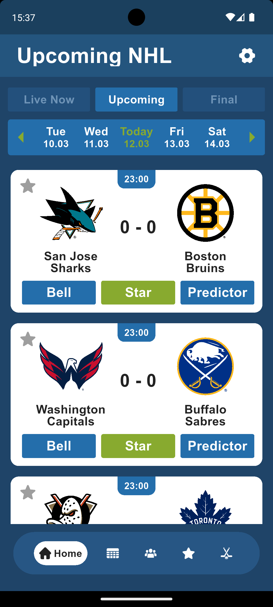
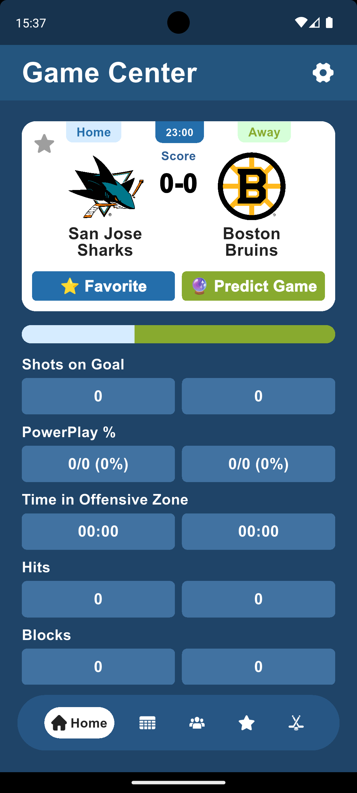
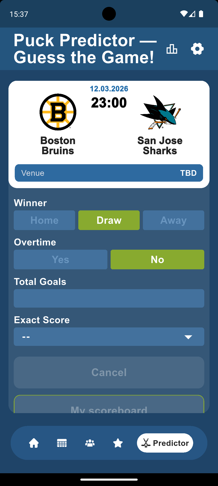
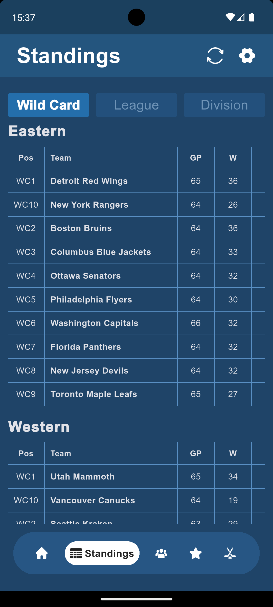

# Ice Hockey Live & Bets

Stay on top of the ice with comprehensive hockey stats. Track matches, analyze player performance, place bets, and never miss a moment with custom event notifications.

---

## 🚀 Status
- **Google Play Store:** ✅ Verified & Published
- **Current Version:** 1.0.0
- **Build:** Flutter Stable Channel

## 📖 Overview
A specialized mobile solution developed for a **Gambling Affiliate Program**, designed to engage users through deep sports analytics, interactive betting features, and a robust notification system that drives high retention rates.

## ✨ Key Features
* **Comprehensive Analytics:** Deep dive into match, team, and individual player statistics.
* **Live Match Tracking:** Real-time updates and results for all major hockey fixtures.
* **Betting Ecosystem:** Place simulated or affiliate-linked bets, track your history, and analyze your personal success metrics.
* **Custom Notifications:** Set highly personalized push alerts for any hockey event, match start, or live score change.

## 📸 Screenshots

  
  
  
  

